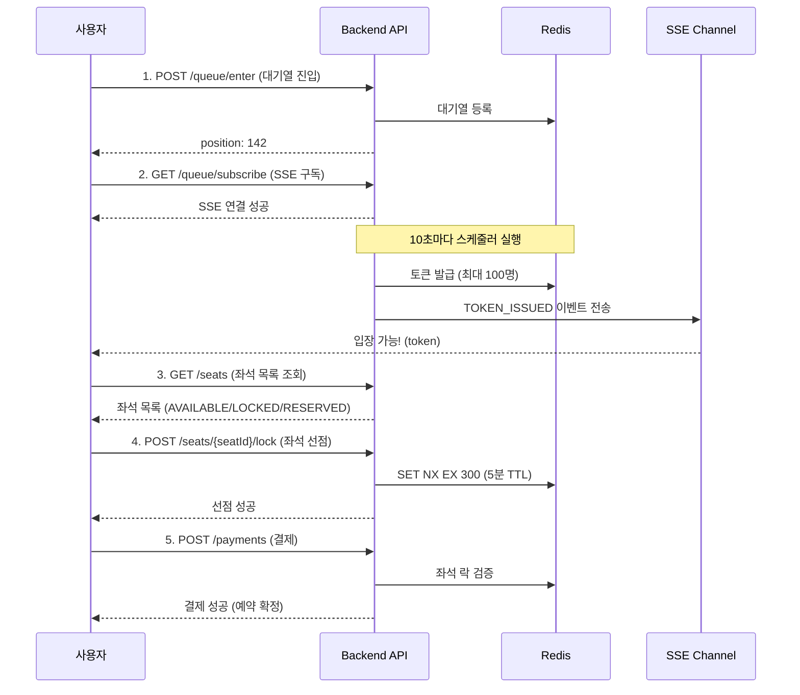

# Turnstile API Documentation

대규모 예약 시스템 - 프론트엔드 개발자 가이드

---

## 목차

1. [시스템 개요](#시스템-개요)
2. [전체 플로우](#전체-플로우)
3. [API 엔드포인트](#api-엔드포인트)
   - [이벤트 API](#1-이벤트-api)
   - [대기열 API](#2-대기열-api)
   - [좌석 API](#3-좌석-api)
   - [결제 API](#4-결제-api)
4. [SSE (Server-Sent Events)](#sse-server-sent-events)
5. [에러 처리](#에러-처리)
6. [클라이언트 구현 예시](#클라이언트-구현-예시)

---

## 시스템 개요

### 핵심 기능

1. **대기열 시스템**: 동시 접속자 제한 (이벤트별 `maxConcurrentUsers` 설정)
2. **좌석 선점**: Redis 기반 동시성 제어 (5분 TTL)
3. **실시간 알림**: SSE를 통한 대기열 상태 및 입장 알림
4. **결제 처리**: Mock 결제 (80% 성공률)

### 데이터 구조

```
Event (이벤트) → Seat (좌석) → Reservation (예약) → Payment (결제)
                      ↓
                 Queue (대기열) → Token (입장 토큰) → Seat Lock (좌석 선점)
```

---

## 전체 플로우



---

## API 엔드포인트

### Base URL
```
http://localhost:8080/api
```

---

## 1. 이벤트 API

### 1.1 이벤트 목록 조회

**GET** `/events`

이용 가능한 이벤트 목록을 조회합니다.

#### Response
```json
{
  "success": true,
  "data": [
    {
      "eventId": "EVT001",
      "name": "2026 신년 콘서트",
      "venue": "올림픽 체조경기장",
      "eventDate": "2026-02-01T19:00:00",
      "status": "OPEN",
      "statusDescription": "예매 진행중",
      "maxConcurrentUsers": 100
    }
  ]
}
```

#### 상태 코드
- `200 OK`: 성공

---

### 1.2 이벤트 상세 조회

**GET** `/events/{eventId}`

특정 이벤트의 상세 정보를 조회합니다.

#### Parameters
- `eventId` (path): 이벤트 ID (예: EVT001)

#### Response
```json
{
  "success": true,
  "data": {
    "eventId": "EVT001",
    "name": "2026 신년 콘서트",
    "venue": "올림픽 체조경기장",
    "eventDate": "2026-02-01T19:00:00",
    "status": "OPEN",
    "statusDescription": "예매 진행중",
    "maxConcurrentUsers": 100
  }
}
```

#### 이벤트 상태
- `UPCOMING`: 예정
- `OPEN`: 예매 진행중 ⭐ (예매 가능)
- `CLOSED`: 예매 종료
- `SOLD_OUT`: 매진

---

## 2. 대기열 API

### 2.1 대기열 진입

**POST** `/events/{eventId}/queue/enter`

대기열에 진입합니다. 진입 후 SSE를 구독해야 입장 알림을 받을 수 있습니다.

#### Request
```json
{
  "userId": "user123"
}
```

#### Response (대기 중)
```json
{
  "success": true,
  "data": {
    "eventId": "EVT001",
    "userId": "user123",
    "position": 142,
    "totalWaiting": 500,
    "estimatedWaitSeconds": 426,
    "canEnter": false,
    "token": null
  }
}
```

#### Response (이미 입장 가능)
```json
{
  "success": true,
  "data": {
    "eventId": "EVT001",
    "userId": "user123",
    "position": 0,
    "totalWaiting": 0,
    "estimatedWaitSeconds": 0,
    "canEnter": true,
    "token": "abc-123-uuid-456-def"
  }
}
```

#### 에러
- `400 BAD_REQUEST`: 이벤트가 OPEN 상태가 아님
- `404 NOT_FOUND`: 이벤트를 찾을 수 없음
- `409 CONFLICT`: 이미 대기열에 등록됨

---

### 2.2 대기열 상태 SSE 구독 ⭐ (권장)

**GET** `/events/{eventId}/queue/subscribe?userId={userId}`

**SSE (Server-Sent Events)** 연결을 맺어 실시간으로 대기열 상태를 수신합니다.

#### Parameters
- `eventId` (path): 이벤트 ID
- `userId` (query): 사용자 ID

#### Headers
```
Accept: text/event-stream
```

#### SSE 이벤트 타입

**1) QUEUE_UPDATE** - 순번 업데이트
```javascript
event: QUEUE_UPDATE
data: {
  "eventType": "QUEUE_UPDATE",
  "eventId": "EVT001",
  "userId": "user123",
  "position": 50,
  "totalWaiting": 200,
  "estimatedWaitSeconds": 150,
  "canEnter": false
}
```

**2) TOKEN_ISSUED** - 입장 가능 (토큰 발급)
```javascript
event: TOKEN_ISSUED
data: {
  "eventType": "TOKEN_ISSUED",
  "eventId": "EVT001",
  "userId": "user123",
  "position": 0,
  "canEnter": true,
  "token": "abc-123-uuid-456-def",
  "message": "입장 가능합니다. 좌석을 선택해주세요."
}
```

**3) QUEUE_LEFT** - 대기열 이탈
```javascript
event: QUEUE_LEFT
data: {
  "eventType": "QUEUE_LEFT",
  "eventId": "EVT001",
  "userId": "user123",
  "message": "대기열에서 이탈하였습니다."
}
```

#### 사용 예시 (JavaScript)
```javascript
const eventSource = new EventSource(
  '/api/events/EVT001/queue/subscribe?userId=user123'
);

// 순번 업데이트
eventSource.addEventListener('QUEUE_UPDATE', (event) => {
  const data = JSON.parse(event.data);
  console.log(`현재 ${data.position}번째 대기 중`);
});

// 입장 가능 알림
eventSource.addEventListener('TOKEN_ISSUED', (event) => {
  const data = JSON.parse(event.data);
  localStorage.setItem('entryToken', data.token);
  eventSource.close(); // 연결 종료
  window.location.href = '/seats'; // 좌석 선택 페이지로 이동
});
```

---

### 2.3 대기열 상태 조회 (폴링 방식)

**GET** `/events/{eventId}/queue/status?userId={userId}`

**⚠️ 하위 호환용**: SSE를 지원하지 않는 환경에서만 사용하세요.

#### Parameters
- `eventId` (path): 이벤트 ID
- `userId` (query): 사용자 ID

#### Response
```json
{
  "success": true,
  "data": {
    "position": 50,
    "totalWaiting": 200,
    "estimatedWaitSeconds": 150,
    "canEnter": false,
    "token": null
  }
}
```

---

### 2.4 대기열 이탈

**DELETE** `/events/{eventId}/queue/leave?userId={userId}`

대기열에서 이탈합니다. SSE 연결도 자동으로 종료됩니다.

#### Parameters
- `eventId` (path): 이벤트 ID
- `userId` (query): 사용자 ID

#### Response
```json
{
  "success": true,
  "message": "대기열에서 이탈하였습니다."
}
```

---

### 2.5 대기열 통계 (관리자용)

**GET** `/events/{eventId}/queue/stats`

현재 대기열 통계를 조회합니다.

#### Response
```json
{
  "success": true,
  "data": {
    "eventId": "EVT001",
    "totalWaiting": 500,
    "sseConnections": 480
  }
}
```

---

## 3. 좌석 API

### 3.1 좌석 목록 조회

**GET** `/events/{eventId}/seats?section={section}`

이벤트의 좌석 목록을 조회합니다.

#### Parameters
- `eventId` (path): 이벤트 ID
- `section` (query, optional): 구역 필터 (A, B, C 등)

#### Response
```json
{
  "success": true,
  "data": [
    {
      "seatId": "A-1-1",
      "eventId": "EVT001",
      "section": "A",
      "rowNum": 1,
      "seatNum": 1,
      "grade": "VIP",
      "gradeDescription": "VIP석",
      "price": 200000,
      "status": "AVAILABLE",
      "statusDescription": "선택 가능"
    },
    {
      "seatId": "A-1-2",
      "eventId": "EVT001",
      "section": "A",
      "rowNum": 1,
      "seatNum": 2,
      "grade": "VIP",
      "gradeDescription": "VIP석",
      "price": 200000,
      "status": "LOCKED",
      "statusDescription": "선점 중"
    },
    {
      "seatId": "A-1-3",
      "eventId": "EVT001",
      "section": "A",
      "rowNum": 1,
      "seatNum": 3,
      "grade": "VIP",
      "gradeDescription": "VIP석",
      "price": 200000,
      "status": "RESERVED",
      "statusDescription": "예약 완료"
    }
  ]
}
```

#### 좌석 상태
- `AVAILABLE`: 선택 가능 ⭐
- `LOCKED`: 다른 사용자가 선점 중 (5분 내 결제 예정)
- `RESERVED`: 예약 완료 (결제 완료)

#### 좌석 등급
- `VIP`: VIP석 (200,000원)
- `R`: R석 (150,000원)
- `S`: S석 (100,000원)
- `A`: A석 (70,000원)

---

### 3.2 좌석 상세 조회

**GET** `/events/{eventId}/seats/{seatId}`

특정 좌석의 상세 정보를 조회합니다.

#### Parameters
- `eventId` (path): 이벤트 ID
- `seatId` (path): 좌석 ID (예: A-1-3)

#### Response
```json
{
  "success": true,
  "data": {
    "seatId": "A-1-3",
    "eventId": "EVT001",
    "section": "A",
    "rowNum": 1,
    "seatNum": 3,
    "grade": "VIP",
    "gradeDescription": "VIP석",
    "price": 200000,
    "status": "AVAILABLE",
    "statusDescription": "선택 가능"
  }
}
```

---

### 3.3 좌석 선점 ⭐

**POST** `/events/{eventId}/seats/{seatId}/lock`

좌석을 선점합니다. **5분 동안 유효**하며, 5분 내 결제하지 않으면 자동으로 해제됩니다.

#### Headers
```
X-Entry-Token: {입장 토큰}
```

#### Request
```json
{
  "userId": "user123"
}
```

#### Response (성공)
```json
{
  "success": true,
  "data": {
    "eventId": "EVT001",
    "seatId": "A-1-3",
    "userId": "user123",
    "locked": true,
    "expiresInSeconds": 300,
    "reason": null
  }
}
```

#### Response (이미 본인이 선점한 경우)
```json
{
  "success": true,
  "data": {
    "eventId": "EVT001",
    "seatId": "A-1-3",
    "userId": "user123",
    "locked": true,
    "expiresInSeconds": 180,
    "reason": "ALREADY_OWNED"
  }
}
```

#### 에러
- `401 UNAUTHORIZED`: 입장 토큰이 없거나 만료됨
- `404 NOT_FOUND`: 좌석을 찾을 수 없음
- `409 CONFLICT`:
  - `SEAT_ALREADY_LOCKED`: 다른 사용자가 선점 중
  - `SEAT_ALREADY_RESERVED`: 이미 예약 완료된 좌석

---

### 3.4 좌석 선점 해제

**DELETE** `/events/{eventId}/seats/{seatId}/lock?userId={userId}`

선점한 좌석을 해제합니다.

#### Parameters
- `eventId` (path): 이벤트 ID
- `seatId` (path): 좌석 ID
- `userId` (query): 사용자 ID

#### Response
```json
{
  "success": true,
  "message": "좌석 선점이 해제되었습니다."
}
```

#### 에러
- `403 FORBIDDEN`: 본인이 선점한 좌석이 아님

---

## 4. 결제 API

### 4.1 결제 요청

**POST** `/payments`

선점한 좌석에 대한 결제를 진행합니다. **Mock 결제**로 80% 확률로 성공합니다.

#### Request
```json
{
  "userId": "user123",
  "eventId": "EVT001",
  "seatId": "A-1-3"
}
```

#### Response (성공)
```json
{
  "success": true,
  "data": {
    "paymentId": "PAY-ABC12345",
    "reservationId": "RSV-XYZ67890",
    "userId": "user123",
    "amount": 200000,
    "status": "SUCCESS",
    "statusDescription": "결제 성공",
    "paidAt": "2026-01-07T14:30:00"
  }
}
```

#### 에러
- `400 BAD_REQUEST`:
  - `SEAT_LOCK_EXPIRED`: 좌석 선점 시간 만료 (5분 초과)
  - `PAYMENT_FAILED`: 결제 실패 (재시도 가능)
- `403 FORBIDDEN`: 본인이 선점한 좌석이 아님
- `409 CONFLICT`: 이미 예약 완료된 좌석

---

### 4.2 결제 정보 조회

**GET** `/payments/{paymentId}`

결제 정보를 조회합니다.

#### Parameters
- `paymentId` (path): 결제 ID

#### Response
```json
{
  "success": true,
  "data": {
    "paymentId": "PAY-ABC12345",
    "reservationId": "RSV-XYZ67890",
    "userId": "user123",
    "amount": 200000,
    "status": "SUCCESS",
    "statusDescription": "결제 성공",
    "paidAt": "2026-01-07T14:30:00"
  }
}
```

---

### 4.3 예약 목록 조회

**GET** `/users/{userId}/reservations`

사용자의 예약 목록을 조회합니다.

#### Parameters
- `userId` (path): 사용자 ID

#### Response
```json
{
  "success": true,
  "data": [
    {
      "reservationId": "RSV-XYZ67890",
      "eventId": "EVT001",
      "seatId": "A-1-3",
      "userId": "user123",
      "paymentId": "PAY-ABC12345",
      "amount": 200000,
      "status": "CONFIRMED",
      "statusDescription": "예약 확정",
      "confirmedAt": "2026-01-07T14:30:00"
    }
  ]
}
```

---

### 4.4 예약 상세 조회

**GET** `/reservations/{reservationId}`

예약 상세 정보를 조회합니다.

#### Parameters
- `reservationId` (path): 예약 ID

#### Response
```json
{
  "success": true,
  "data": {
    "reservationId": "RSV-XYZ67890",
    "eventId": "EVT001",
    "seatId": "A-1-3",
    "userId": "user123",
    "paymentId": "PAY-ABC12345",
    "amount": 200000,
    "status": "CONFIRMED",
    "statusDescription": "예약 확정",
    "confirmedAt": "2026-01-07T14:30:00"
  }
}
```

---

## SSE (Server-Sent Events)

### 개요

대기열 상태를 **실시간**으로 수신하기 위해 SSE를 사용합니다.

### 연결 방법

```javascript
const eventSource = new EventSource(
  `/api/events/${eventId}/queue/subscribe?userId=${userId}`
);
```

### 이벤트 리스너 등록

```javascript
// 순번 업데이트
eventSource.addEventListener('QUEUE_UPDATE', (event) => {
  const data = JSON.parse(event.data);
  updateWaitingUI(data.position, data.estimatedWaitSeconds);
});

// 입장 가능 알림
eventSource.addEventListener('TOKEN_ISSUED', (event) => {
  const data = JSON.parse(event.data);
  saveToken(data.token);
  eventSource.close();
  navigateToSeats();
});

// 에러 처리
eventSource.onerror = (error) => {
  console.error('SSE error:', error);
  eventSource.close();
};
```

### 연결 종료

```javascript
eventSource.close();
```

---

## 에러 처리

### 에러 응답 형식

```json
{
  "success": false,
  "error": {
    "code": "S002",
    "message": "이미 다른 사용자가 선점한 좌석입니다."
  },
  "timestamp": "2026-01-07T14:30:00"
}
```

### 에러 코드

#### 이벤트 (E)
- `E001`: 이벤트를 찾을 수 없습니다
- `E002`: 예매가 진행 중인 이벤트가 아닙니다

#### 대기열 (Q)
- `Q001`: 이미 대기열에 등록되어 있습니다
- `Q002`: 대기열에 등록되어 있지 않습니다
- `Q003`: 대기열 진입에 실패했습니다

#### 토큰 (T)
- `T001`: 입장 토큰이 없습니다
- `T002`: 입장 토큰이 만료되었습니다
- `T003`: 유효하지 않은 입장 토큰입니다

#### 좌석 (S)
- `S001`: 좌석을 찾을 수 없습니다
- `S002`: 이미 다른 사용자가 선점한 좌석입니다
- `S003`: 이미 예약 완료된 좌석입니다
- `S004`: 본인이 선점한 좌석이 아닙니다
- `S005`: 좌석 선점 시간이 만료되었습니다

#### 결제 (P)
- `P001`: 결제에 실패했습니다
- `P002`: 결제 정보를 찾을 수 없습니다

#### 예약 (R)
- `R001`: 예약 정보를 찾을 수 없습니다

#### 공통 (C)
- `C001`: 잘못된 요청입니다
- `C002`: 서버 내부 오류가 발생했습니다

---

## 클라이언트 구현 예시

### 전체 플로우 구현

```javascript
class TurnstileClient {
  constructor(eventId, userId) {
    this.eventId = eventId;
    this.userId = userId;
    this.token = null;
    this.eventSource = null;
  }

  // 1. 대기열 진입
  async enterQueue() {
    const response = await fetch(`/api/events/${this.eventId}/queue/enter`, {
      method: 'POST',
      headers: { 'Content-Type': 'application/json' },
      body: JSON.stringify({ userId: this.userId })
    });

    const result = await response.json();

    if (result.data.canEnter) {
      this.token = result.data.token;
      return { immediate: true, token: this.token };
    }

    return { immediate: false, position: result.data.position };
  }

  // 2. SSE 구독
  subscribeQueue(onUpdate, onTokenIssued) {
    this.eventSource = new EventSource(
      `/api/events/${this.eventId}/queue/subscribe?userId=${this.userId}`
    );

    this.eventSource.addEventListener('QUEUE_UPDATE', (event) => {
      const data = JSON.parse(event.data);
      onUpdate(data);
    });

    this.eventSource.addEventListener('TOKEN_ISSUED', (event) => {
      const data = JSON.parse(event.data);
      this.token = data.token;
      this.eventSource.close();
      onTokenIssued(data);
    });

    this.eventSource.onerror = () => {
      console.error('SSE connection error');
      this.eventSource.close();
    };
  }

  // 3. 좌석 목록 조회
  async getSeats(section = null) {
    const url = section
      ? `/api/events/${this.eventId}/seats?section=${section}`
      : `/api/events/${this.eventId}/seats`;

    const response = await fetch(url);
    const result = await response.json();
    return result.data;
  }

  // 4. 좌석 선점
  async lockSeat(seatId) {
    const response = await fetch(
      `/api/events/${this.eventId}/seats/${seatId}/lock`,
      {
        method: 'POST',
        headers: {
          'Content-Type': 'application/json',
          'X-Entry-Token': this.token
        },
        body: JSON.stringify({ userId: this.userId })
      }
    );

    if (!response.ok) {
      const error = await response.json();
      throw new Error(error.error.message);
    }

    const result = await response.json();
    return result.data;
  }

  // 5. 결제
  async processPayment(seatId) {
    const response = await fetch('/api/payments', {
      method: 'POST',
      headers: { 'Content-Type': 'application/json' },
      body: JSON.stringify({
        userId: this.userId,
        eventId: this.eventId,
        seatId: seatId
      })
    });

    if (!response.ok) {
      const error = await response.json();
      throw new Error(error.error.message);
    }

    const result = await response.json();
    return result.data;
  }

  // 대기열 이탈
  async leaveQueue() {
    if (this.eventSource) {
      this.eventSource.close();
    }

    await fetch(
      `/api/events/${this.eventId}/queue/leave?userId=${this.userId}`,
      { method: 'DELETE' }
    );
  }
}

// 사용 예시
const client = new TurnstileClient('EVT001', 'user123');

// 1. 대기열 진입
const queueResult = await client.enterQueue();

if (!queueResult.immediate) {
  // 2. SSE 구독
  client.subscribeQueue(
    (data) => {
      console.log(`대기 순번: ${data.position}`);
      updateUI(data.position, data.estimatedWaitSeconds);
    },
    (data) => {
      console.log('입장 가능!', data.token);
      navigateToSeats();
    }
  );
}

// 3. 좌석 목록 조회
const seats = await client.getSeats();

// 4. 좌석 선점
try {
  const lockResult = await client.lockSeat('A-1-3');
  console.log('선점 성공:', lockResult);
  startCountdown(lockResult.expiresInSeconds);
} catch (error) {
  alert(error.message);
}

// 5. 결제
try {
  const payment = await client.processPayment('A-1-3');
  console.log('결제 성공:', payment);
  navigateToConfirmation(payment.reservationId);
} catch (error) {
  alert('결제 실패: ' + error.message);
}
```

---

## 주요 시나리오

### 시나리오 1: 정상 예약 플로우

```
1. POST /queue/enter → position: 142
2. GET /queue/subscribe (SSE) → 대기
3. SSE: TOKEN_ISSUED → token 수신
4. GET /seats → 좌석 목록 확인
5. POST /seats/{seatId}/lock → 선점 성공 (5분 타이머 시작)
6. POST /payments → 결제 성공
7. GET /reservations/{reservationId} → 예약 확정 확인
```

### 시나리오 2: 좌석 선점 만료

```
1~5. (동일)
6. 5분 경과 → Redis TTL 만료
7. POST /payments → 400 SEAT_LOCK_EXPIRED
8. POST /seats/{seatId}/lock → 409 SEAT_ALREADY_LOCKED (다른 사람이 선점)
```

### 시나리오 3: 결제 실패 후 재시도

```
1~5. (동일)
6. POST /payments → 400 PAYMENT_FAILED (Mock 실패)
7. POST /payments (재시도) → 200 SUCCESS (성공)
```

---

## 타임아웃 및 제한

| 항목 | 시간/값 |
|-----|--------|
| 입장 토큰 TTL | 10분 |
| 좌석 선점 TTL | 5분 |
| SSE 연결 타임아웃 | 30분 |
| 동시 입장 인원 | 이벤트별 설정 (EVT001: 100명) |
| 스케줄러 실행 주기 | 10초 |

---

## 문의

- Backend Repository: `/src/main/java/mingovvv/turnstile/`
- API 문서 최종 수정일: 2026-01-07
